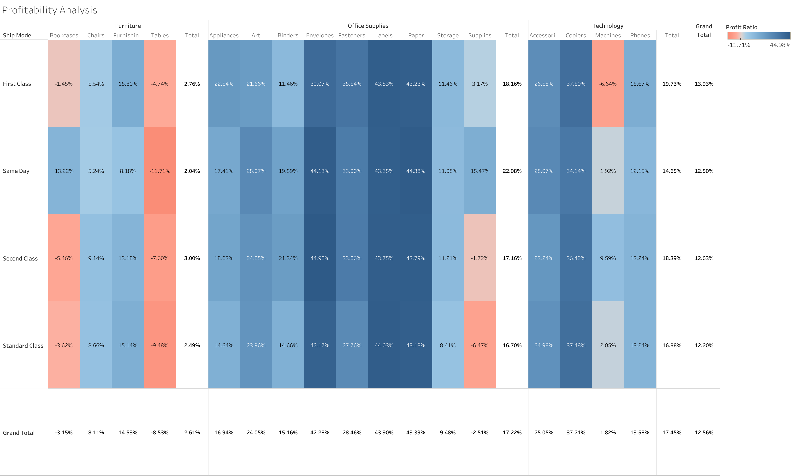
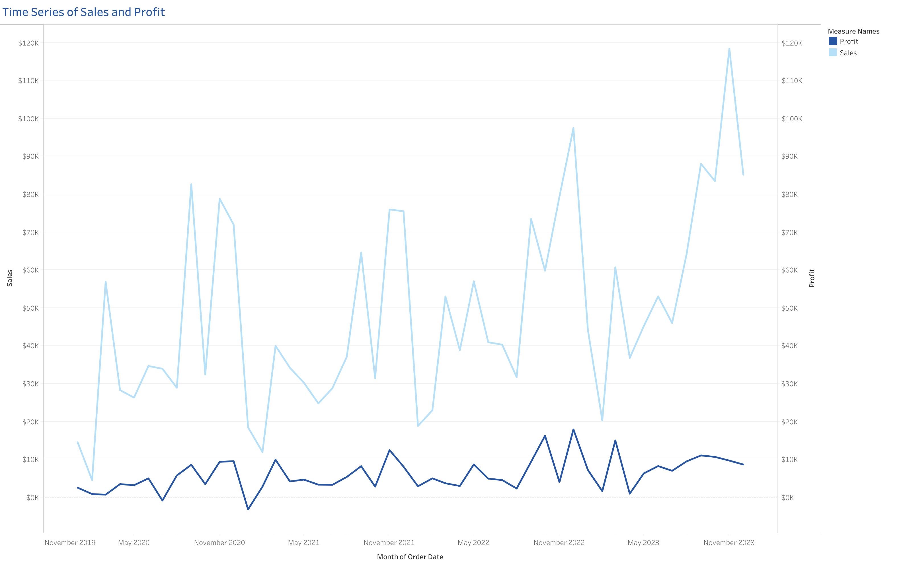

# Retail Sales & Shipping Performance Analysis

> This project analyzes retail sales, profitability, and shipping performance to understand sales and profit trends and identify shipping issues.

## Business Question

**Is the business growing profitably, and where are the main shipping performance issues?**

## Key Insights

1. **Standard Class has the longest average delivery time at 5.0 days, compared with 3.2 days for Second Class and 2.2 days for First Class.**
2. **Office Supplies has positive profit ratios across all shipping modes, while Tables has negative profit ratios in every shipping mode.**
3. **Profit generally follows the sales trend, but some increases in sales do not lead to the same increase in profit.**
---

## Shipping Performance

**Insight:** Standard Class has the longest average delivery time at **5.0 days**, compared with **3.2 days for Second Class** and **2.2 days for First Class**.

---

## Profitability Analysis

**Insight:****Insight:** Office Supplies remains profitable across all shipping modes, ranging from **16.70% to 22.08%**. In contrast, Tables are unprofitable across every shipping mode, with profit ratios ranging from **-11.71% to -4.74%**.

---

## Sales & Profit Trend

**Insight:** Profit generally follows the sales trend, but some increases in sales do not lead to the same increase in profit.

---

## Recommendations

- Review the factors behind the longer average delivery time for Standard Class.
- Investigate Tables and other sub-categories with negative profit ratios.
- Monitor sales and profit together when evaluating business performance.
---

## Tools

**Tableau · Data Visualization · Business Analysis**
