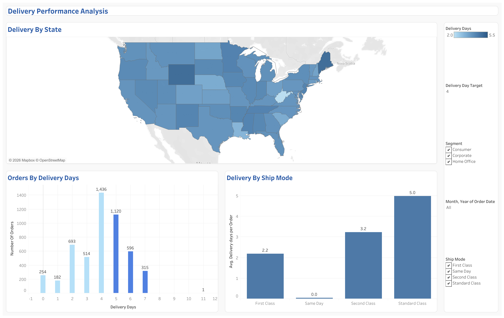

# Retail Sales & Shipping Performance Analysis

## Overview
This project analyzes retail sales, profitability, and shipping performance to understand how the business is performing and where the main issues are.

## Business Problem
Is the business growing profitably, and where are the main shipping performance issues?

### Key Insight

**Out of 5,111 orders, about 60% are shipped within the 4-day target, while around 40% take longer.**

## Key Questions
- Where is the business generating or losing profit?
  
- Are higher sales translating into higher profits over time?

- Which shipping methods and locations have longer shipping times?

## Shipping Performance Dashboard

[View Interactive Dashboard on Tableau Public](https://public.tableau.com/views/DeliveryPerformanceAnalysis_17894588655280/Dashboard1?:language=en-US&:sid=&:redirect=auth&:display_count=n&:origin=viz_share_link)
